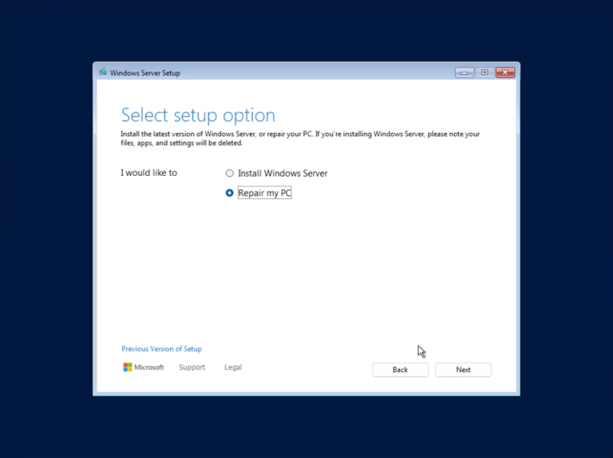
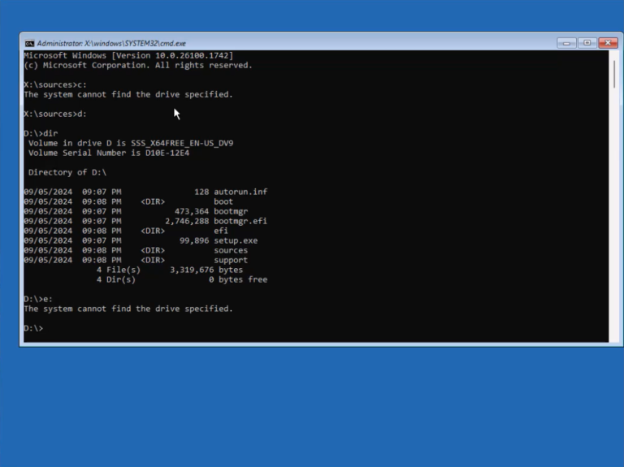
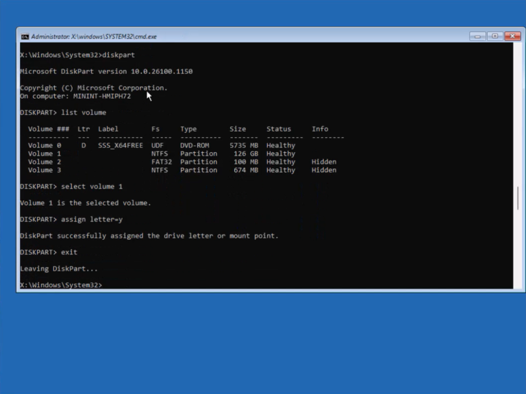
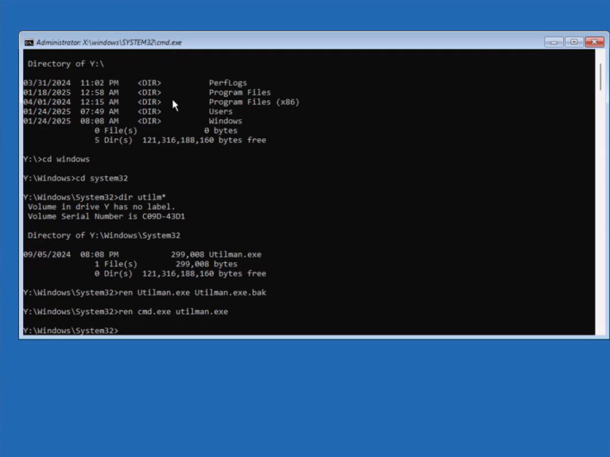
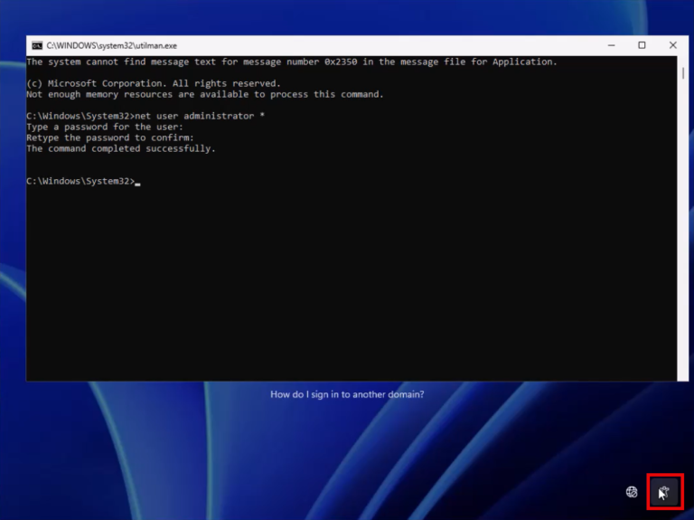
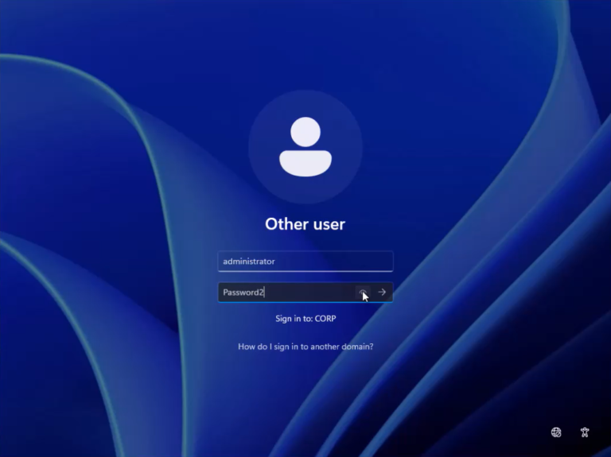
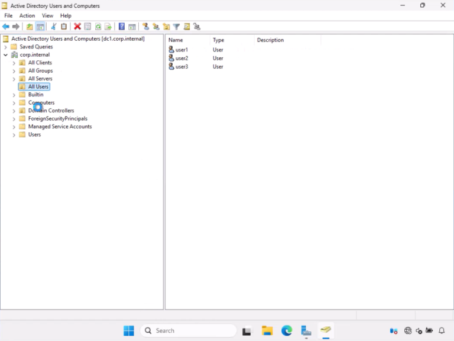
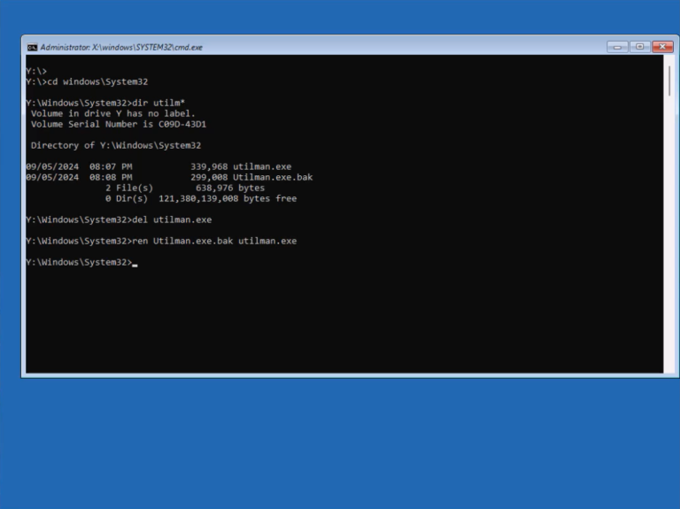
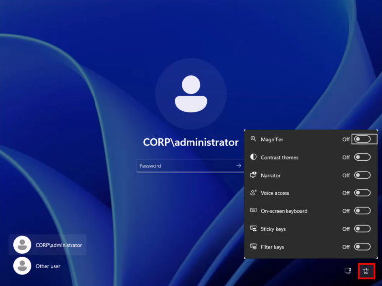

# Reset a forgotten domain or local admin password

ถ้า domain admin คนเดิมลาออกไป แต่เราไม่ทราบ password แล้วต้องการ reset ให้เรา boot domain controller (DC) ด้วยแผ่น ISO ติดตั้ง Windows แล้วไป reset กันนะครับ

>หมายเหตุ: ตัวอย่างนี้ เป็น Windows Server 2025 นะครับ

## 1. Change Utilman.exe to cmd.exe

1\. Boot เครื่องด้วยแผ่นติดตั้ง Windows

แล้วเลือก repair



2\. เข้าไป partition ที่มี Windows ติดตั้งอยู่

เช่น ลองเปลี่ยน drive ไปที่ C: D: E: F: G: ไปเรื่อยๆ

เราอาจจะเจอสัก drive ที่มี Windows ติดตั้งอยู่

แต่ถ้าไม่เจอ ก็ไม่ต้องกังวลนะครับ



ให้เราใช้ diskpart เข้าไป assign drive letter ให้กับ partition ที่มี Windows ติดตั้งอยู่

```
diskpart

list volume

select volume <volume-name>

assign letter=<drive-letter>

exit
```



แล้วเปลี่ยนไป drive ที่เราพึ่ง assign drive letter ไป เช่น y:

3\. Backup Utilman.exe แล้วนำ cmd.exe ไปเป็น Utilman.exe ชั่วคราว

เข้าไปที่ windows\system32 folder

```
cd windows\system32
```

แล้ว copy ไฟล์ utilman.exe เก็บไว้ (เติม .bak ต่อท้ายไฟล์ก็ได้)

จากนั้น copy cmd.exe มาแทน utilman.exe

แล้ว exit

```
ren utilman.exe utilman.exe.bak

ren cmd.exe utilman.exe
```



พอเรา exit ก็กด continue เข้าสู่หน้า Windows logon ต่อไปครับ

## 2. Reset the password

ตั้ง password ใหม่ของ domain admin หรือ admin ผ่านปุ่ม Utilman ในหน้า Windows logon

รันคำสั่ง แล้วตั้ง password ใหม่

```
net user administrator *
```



จากนั้น ก็ sign in ด้วย password ใหม่



ตอนนี้ เราก็เข้า DC ด้วย password ใหม่ได้แล้วนะครับ



## 3. Bring Utilman.exe back

นำ Utilman.exe เดิมกลับมา

ในขั้นตอนสุดท้าย เพื่อความปลอดภัย เราก็ reboot เครื่องด้วยแผ่นติดตั้งอีกครั้ง

แล้วนำ utilman.exe ไฟล์เดิมกลับมา



เวลา hacker เข้าถึงหน้าเครื่องเรา แล้วกด utilman จะได้ไม่ขึ้น cmd.exe นั่นเองครับ



## Video

<iframe width="560" height="315" src="https://www.youtube.com/embed/wLno9bYu2pc?si=4DsnX3Z7BPj_lfR1" title="YouTube video player" frameborder="0" allow="accelerometer; autoplay; clipboard-write; encrypted-media; gyroscope; picture-in-picture; web-share" referrerpolicy="strict-origin-when-cross-origin" allowfullscreen></iframe>

## References

- <a href="https://4sysops.com/archives/reset-a-windows-10-password/">Reset a Windows 10 password</a>


