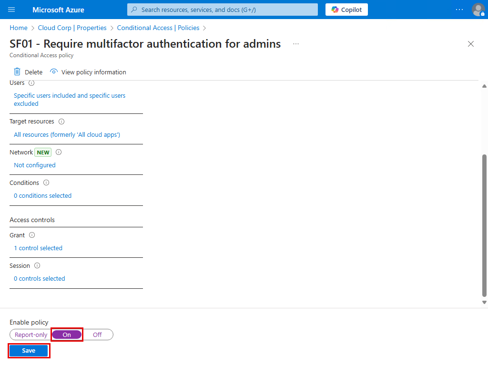
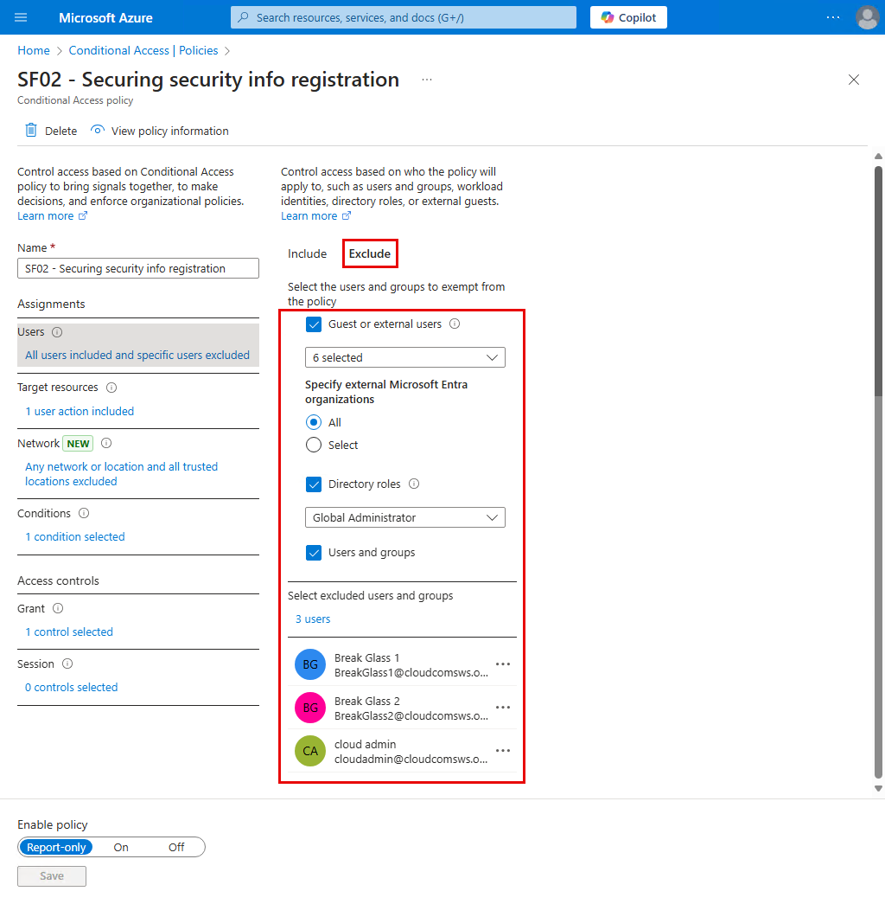
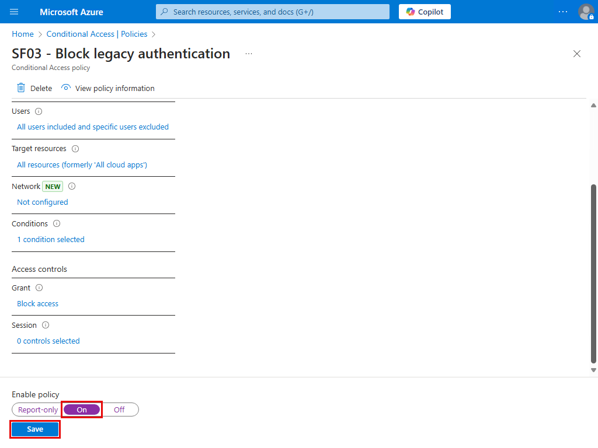
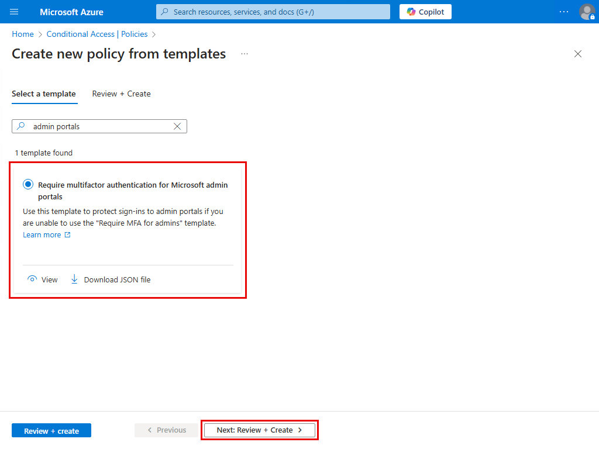

# Conditional Access policy templates for Secure foundation

Conditional Access templates จาก <a href="https://learn.microsoft.com/en-us/entra/identity/conditional-access/concept-conditional-access-policy-common?tabs=secure-foundation">Conditional Access policy templates</a> ช่วยให้เราสามารถสร้าง policy ตามคำแนะนำจาก Microsoft ได้โดยง่าย

Templates มีหลายหมวด ในคู่มือนี้จะทำหมวด Secure foundation ซึ่งเป็น Conditional Access พื้นฐานที่ทุกองค์กรควรทำนะครับ

## Prerequisites

### Review enabled authentication methods

Conditional Access สามารถใช้งานร่วมกับ MFA ได้หลายแบบ เราอาจจะตรวจสอบก่อนว่า tenant ของเรา ได้เปิดใช้งาน MFA ครบทุกแบบตามที่เราต้องการแล้วหรือยัง?


### Create a pilot user group

Conditional Access ที่ apply เข้าหา All users อาจกระทบการใช้งานโดยไม่คาดคิด ในช่วงเริ่มต้น เราควร apply policy บางตัวเข้าหา pilot user group เพื่อทดสอบก่อน


## 1. SF01 - Require multifactor authentication for admins

Account ที่มีสิทธิ์บริหารจัดการระบบมักเป็นเป้าหมายของผู้บุกรุก เขาควรถููกบังคับใช้ MFA เพื่อลดความเสี่ยงจากการถูกโจมตี

### 1.1 Create the policy


ปรับชื่อ policy ตามความเหมาะสม, รีวิวค่า settings เริ่มต้น, แล้ว Create


### 1.2 Adjust & turn on the policy

1\. กดเข้าไปใน policy


2\. ที่ Users > Exclude

- ควรเพิ่ม emergency access หรือ break-glass account จาก <a href="https://learn.microsoft.com/en-us/entra/identity/role-based-access-control/security-emergency-access">Manage emergency access accounts in Microsoft Entra ID</a> 
- และเพิ่ม servie account ที่จำเป็น เช่น service account ที่ไม่รองรับ MFA แต่เป็นสมาชิกของ administrative role ใด role นึงอยู่


3\. เปิดใช้งาน policy แล้ว Save



ตอนนี้เราได้ Conditional Access policy สำหรับ Secure foundtaion ตัวแรกแล้วนะครับ


## 2. SF02 - Securing security info registration

หากเราต้องการให้ผู้ใช้ต้องทำ MFA ก่อนเข้า Security info ของตัวเอง ก็สามารถใช้ policy ตัวนี้ได้


### 1.1 Create the policy


ปรับชื่อ policy ตามความเหมาะสม, รีวิวค่า settings เริ่มต้น, แล้ว Create


### 1.2 Adjust & turn on the policy

1\. กดเข้าไปใน policy


2\. ที่ Users > Exclude

เพิ่ม break-glass account เข้าไป



3\. เปิดใช้งาน policy แล้ว Save


### 1.3 Test

1\. ทดลองเข้า security info เราจะถูก request MFA


2\. แต่ถ้าเราไม่ต้องการให้มี MFA ถ้าผู้ใช้กำลังใช้งานอยู่ใน network ภายในของบริษัท

เราอาจสร้าง location เช่น HQ

- ระบุ public IP ที่ client ใน HQ ใช้ access Internet
- แล้ว mark เป็น trusted locations


3\. เมื่อลองเข้า Security info จาก HQ network อีกครั้ง


ก็จะไม่มี MFA prompt ครับ


## 3. SF03 - Block legacy authentication

Microsoft แนะนำให้เรา block authentication protocol เก่าๆ ที่ไม่รองรับ MFA เช่น basic authentication

### 3.1 Identify legacy authentication use

ก่อนอื่น ให้เราตรวจสอบจาก Sign-in log ว่า ในบริษัทเรามี app ตัวไหนที่ใช้ legacy authentication protocol อยู่ไหม?

ถ้าพบ ให้เราลองพิจารณาดูว่าจะทำอย่างไรนะครับ


ตัวอย่างเช่น ในภาพนี้ เราพบ SMTP Auth จาก service account ชื่อว่า app1 ที่ยังใช้ basic authentication relay mail มาที่ Exchange Online อยู่ (ควรวางแผนเปลี่ยนไปใช้ OAuth แทน)


### 3.2 Create the policy


ปรับชื่อ policy ตามความเหมาะสม, รีวิวค่า settings เริ่มต้น, แล้ว Create


### 3.3 Adjust & turn on the policy

1\. กดเข้าไปใน policy


2\. ที่ Users > Exclude

เพิ่ม break-glass account เข้าไป


3\. เปิดใช้งาน policy แล้ว Save




### 3.4 Test

ลองส่่ง mail จาก app1 เข้าหา user ในองค์กร ด้วย basic authentication

```
$Username = "app1@cloud.coms.ws"
$Password = "Jxxxxxxxx"
$SecurePassword = ConvertTo-SecureString -String $Password -AsPlainText -Force
$Creds = New-Object System.Management.Automation.PSCredential ($Username, $SecurePassword)

Send-MailMessage -From "app1@cloud.coms.ws" `
                 -To "user1@cloud.coms.ws" `
                 -Subject "Test Email via Basic Authentication" `
                 -Body "This is a test email." `
                 -SmtpServer "smtp.office365.com" `
                 -UseSsl `
                 -Credential $Creds `
                 -Port 587

```

ซึ่งตอนนี้ เราส่งไม่ได้แล้วนะครับ


### 3.5 Migitation

สมมติว่า ช่วงนี้เรายังไม่พร้อมจะเปลี่ยนไปใช้ OAuth เราจึง exclude app1 service account ไม่ให้ถูก policy นี้ apply หาขั่วคราวก่อน

>หมายเหตุ: SMTP AUTH ยังใช้ basic authentication ได้ถึง กันยายน 2568 จาก <a href="https://learn.microsoft.com/en-us/exchange/clients-and-mobile-in-exchange-online/deprecation-of-basic-authentication-exchange-online#pop-imap-and-smtp-auth">Deprecation of Basic authentication in Exchange Online</a>
>


ตอนนี้ app1 ใช้ basic authentication ส่ง mail ได้แล้วนะครับ


## 4. SF04 - Require multifactor authentication for admins accessing Microsoft admin portals

### 4.1 Create the policy

1\. สร้าง policy จาก template



ปรับชื่อ policy ตามความเหมาะสม, รีวิวค่า settings เริ่มต้น, แล้ว Create


### 4.2 Adjust & turn on the policy

1\. กดเข้าไปใน policy


2\. ที่ Users > Exclude

เพิ่ม break-glass account เข้าไป


3\. เปิดใช้งาน policy แล้ว Save


## 5. SF05 - Require multifactor authentication for all users

### 5.1 Create the policy


ปรับชื่อ policy ตามความเหมาะสม, รีวิวค่า settings เริ่มต้น, แล้ว Create


### 5.2 Adjust & turn on the policy

1\. กดเข้าไปใน policy


2\. เราต้องการ pilot การใช้งานก่อน

ดังนั้น ให้เราเปลี่ยน All users เป็น G CA Pilot Users group


3\. ที่ Users > Exclude

เพิ่ม break-glass account และ service account ที่จำเป็นเข้าไป


4\. เปิดใช้งาน policy แล้ว Save


## 6. SF06 - Require multifactor authentication for Azure management

สร้าง policy เพื่อบังคับใช้ MFA เมื่อใช้ Azure management tools เหล่านี้

- Azure portal
- Azure PowerShell
- Azure CLI

### 6.1 Create the policy


ปรับชื่อ policy ตามความเหมาะสม, รีวิวค่า settings เริ่มต้น, แล้ว Create


### 6.2 Adjust & turn on the policy

1\. กดเข้าไปใน policy


2\. ที่ Users > Exclude

เพิ่ม break-glass account เข้าไป


3\. เปิดใช้งาน policy แล้ว Save


## 7. SF07 - Require compliant or Microsoft Entra hybrid joined device or multifactor authentication for all users

หากต้องการ bypass MFA ให้กับผู้ใช้ ที่กำลังใช้งานเครื่อง Entra Hybrid Join หรือ compliant devices (ใน Intune) เราสามารถใช้ policy ตัวนี้ได้

ผู้ใช้ที่ไม่ได้ใช้งานอยู่บนเครื่อง Entra Hybrid Join หรือ compliant devices จะต้องทำ MFA ก่อนเข้าใช้บริการ

### 7.1 Create the policy


ปรับชื่อ policy ตามความเหมาะสม, รีวิวค่า settings เริ่มต้น, แล้ว Create


### 7.2 Adjust & turn on the policy

1\. กดเข้าไปใน policy


2\. เราต้องการ pilot การใช้งานก่อน

ดังนั้น ให้เราเปลี่ยน All users เป็น G CA Pilot Users group


3\. ที่ Users > Exclude

เพิ่ม break-glass account และ service account ที่จำเป็นเข้าไป


4\. เปิดใช้งาน policy แล้ว Save


## 8. SF08 - Require compliant device

### Don't create this policy

หลายๆ องค์กรอาจยังไม่พร้อมที่จะบังคับว่า device ทุกเครื่องจะต้อง compliant (ใน Intune) ก่อนจะถูกอนุญาตให้เข้าใช้บริการ

หากเรา turn on policy ตัวนี้ ผู้ใช้ที่ใช้งานบนเครื่องที่ไม่เป็น compliant devices อาจพบ sign in error คล้ายๆ แบบนี้


ดังนั้น ถ้าองค์กรเราจะยังพร้อมที่จะทำข้อนี้ ณ ตอนนี้ ให้เราข้าม policy นี้ไปก่อนนะครับ


แล้วใช้ policy แค่ 7 ตัว สำหรับ Secure foundation ใน phase แรกนี้ก็พอครับ


## Next steps

ในส่วนของการ pilot ด้วย G CA Pilot Users group  ให้เราค่อยเพิ่มผู้ใช้เข้าไปเรื่อยๆ แล้วเมื่อพร้อมที่จะบังคับใช้ทั้งองค์กร ก็สามารถเปลี่ยน policy ตัวที่ใช้ G CA Pilot Users group อยู่ ไปใช้ All users ได้เลยนะครับ

## References

- <a href="https://learn.microsoft.com/en-us/entra/identity/conditional-access/concept-conditional-access-policy-common?tabs=secure-foundation">Conditional Access policy templates</a>
- <a href="https://learn.microsoft.com/en-us/entra/identity/role-based-access-control/security-emergency-access">Manage emergency access accounts in Microsoft Entra ID</a>
- <a href="https://learn.microsoft.com/en-us/exchange/clients-and-mobile-in-exchange-online/deprecation-of-basic-authentication-exchange-online#pop-imap-and-smtp-auth">Deprecation of Basic authentication in Exchange Online</a>
>

...