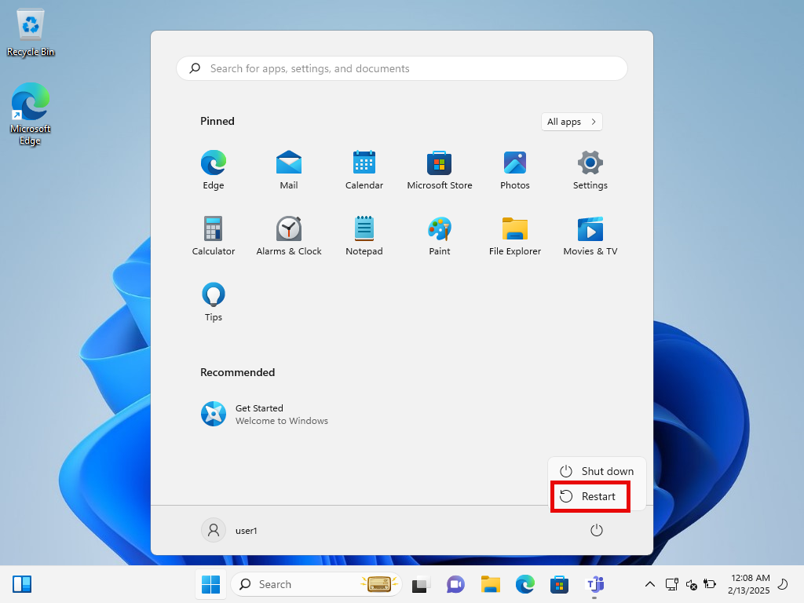

# Microsoft Entra hybrid join targeted deployment

เครื่องคอมพิวเตอร์ที่ join on-premises AD DS อยู่ สามารถนำไป join Entra ID โดยอัตโนมัติได้ด้วยการทำ Entra Hybrid Join

ในขณะที่เราสามารถรีรัน Entra Connect เพื่อสร้าง Service Connection Point (SCP) ลงใน AD DS ให้ทุกเครื่องที่ join domain มองเห็น ตาม <a href="https://learn.microsoft.com/en-us/entra/identity/devices/how-to-hybrid-join#managed-domains">Configure Microsoft Entra hybrid join</a>


เรายังสามารถทำอีกวิธีนึงได้นั่นคือ ทำให้ device แค่บางเครื่องรู้จักข้อมูลของ tenant ผ่านค่า registry บนเครื่อง เช่น deploy ค่าผ่าน GPO ตาม <a href="https://learn.microsoft.com/en-us/entra/identity/devices/hybrid-join-control">Microsoft Entra hybrid join targeted deployment</a>

แล้ว device จะใช้ข้อมูล tenant จาก SCP (ใน AD DS) หรือ registry (บนเครื่อง) เข้าไปทำ Entra Hybrid Join ต่อไป

Entra Hybrid Join ช่วยให้เครื่องที่ join AD DS มี identity ใน Entra ID ได้รับประโยชน์จาก SSO, เป็นสมาชิกของ device group ได้, ใช้ทำ device-based authentication ได้ เป็นต้น

เนื่องจากเราต้องการให้ทุกคนสามารถเริ่มต้นใช้งานระบบต่างๆ ด้วยตัวเองได้ โดยไม่กระทบสิ่งที่ใช้งานอยู่เป็นวงกว้าง ในคู่มือนี้จึงเป็นการทำ Entra Hybrid Join แบบ targeted นะครับ


## 1. Create a pilot device group

สร้าง device group สำหรับ pilot Entra Hybrid Join


## 2. Configure GPO settigs to enable Entra Hybrid join targeted deployment

1\. Copy ค่า Tenant ID และ Tenant name เพื่อนำไปใช้ใน GPO


2\. สร้าง GPO และตั้งค่า settings ตาม <a href="https://learn.microsoft.com/en-us/entra/identity/devices/hybrid-join-control#configure-client-side-registry-setting-for-scp">
Configure client-side registry setting for SCP</a>

แล้ว link ไปที่ device OU ที่เราต้องการ enable Entra Hybrid Join ให้กับ device ภายใต้ OU นั้น


3\. ที่ Security Filtering ของ GPO

- ลบ Authenticated Users ออก (เพื่อไม่ให้ GPO apply เข้าหาทุกเครื่องภายใต้ OU)
- แล้วเพิ่ม pilot device group เข้าไป (เพื่อให้ GPO apply เข้าหาเครื่องที่อยู่ใน group นี้เท่านั้น)


ที่ tab Delegation, ให้สิทธิ์ Read กับ Authenticated Users


## 3. Configure Entra Connect scopes to sync device objects to Entra ID

รีรัน Entra Connect


แล้วเลือก OU ที่มี device ที่ต้องการ sync ไปยัง Entra ID


ตอนนี้ เราตั้งค่าสำหรับทำ targeted deployment ครบถ้วนแล้ว

ดังนั้นเราไปทดลองทำ Entra Hybrid Join ให้กับ pilot device เครื่องแรกกันนะครับ

## 4. Test a pilot client

### 4.1 Move a pilot device to a synced OU, add to the pilot device group, and restart the client

1\. ย้าย client มาอยู่ใน OU ที่ถูก sync ขึ้น Entra ID


2\. เพิ่ม client เข้าไปเป็นสมาชิกของ pilot device group


3\. แล้ว restart เครื่อง client เพื่อให้เครื่องได้รับ SID ของ group



### 4.2 Nothing to do, just wait until success

เมื่อ restart กลับมา เราไม่ต้อง sign in ก็ได้นะครับ

เพียงแค่รอเท่านั้น


Automatic-Device-Join task บน device ที่รันทุกๆ 1 ชั่วโมง (หรือ เมื่อมีผู้ใช้ sign in เข้าเครื่อง) จะค้นหาข้อมูลของ tenant จาก registry บนเครื่อง (ที่ deploy ผ่าน GPO มา)

เมื่อพบข้อมูลของ tenant ก็จะ generate self-signed certificate แล้วนำส่วน public key ไปเขียนลงใน userCertificate attribute ของ computer object ตัวเองใน AD DS


จากนั้น Entra Connect จะ sync computer object เครื่องนั้น ขึ้นไปยัง Entra ID ต่อไป

แต่เครื่องจะยังมีสถานะเป็น Pending อยู่นะครับ


และเมื่อ Automatic-Device-Join task ถึงรอบรันอีกครั้ง

เขาก็จะนำเครื่องเข้าไปทำ authentication กับ Entra ID อีกครั้ง แล้วกลายเป็น Entra Hybrid joined device โดยสมบูรณ์ต่อไป


### 4.3 Test SSO

เมื่อเครื่องเป็น Entra Hybrid join devices โดยสมบูรณ์แล้ว

เราก็ลอง sign in เข้าเครื่อง


ก็จะพบว่า ตอนนี้เราได้รับ Primary Refresh Token (PRT) (ดูที่ SSO State) แล้วนะครับ

```
dsregcmd /status
```


และ app บนเครื่องก็จะนำ PRT นี้ไปทำ SSO เข้าใช้งาน app หรือบริการต่างๆ  ที่ใช้ Entra ID เป็น identity provider ต่อไป


## 5. (Optional) Speed up the process

บางครั้ง ในการทดสอบ pilot device เราคงไม่อยากรอให้ Entra Hybrid Join process เสร็จสมบูรณ์ด้วยตัวของเขาเอง

แต่เราน่าจะอยากเร่งความเร็วของ process ให้เสร็จเร็วขึ้นแทน

ดังนั้น จาก <a href="https://learn.microsoft.com/en-us/entra/identity/devices/device-registration-how-it-works#microsoft-entra-hybrid-joined-in-managed-environments">Microsoft Entra hybrid joined in Managed environments</a>


เรามาลองเร่งความเร็วของ process ด้วยตัวเองดูนะครับ

1\. Sign in เข้าเครื่อง โดยไม่ต้องรอ เพื่อ trigger ให้ Automatic-Device-Join task รันเลย


Task จะ generate self-signed certificate แล้วส่งส่วนของ public key ไปแปะไว้ใน computer object ของตัวเองใน AD DS


2\. Force Entra Connect ให้ sync computer object ไปยัง Entra ID โดยไม่ต้องรอรอบ sync ทุกๆ 30 นาที


แล้ว computer object จะถูก sync ขึ้นไป แต่สถานะจะยังเป็น Pending อยู่


3\. และสุดท้าย ให้เรา manual รัน Automatic-Device-Join task เพื่อเข้าไปทำ authentication กับ Entra ID อีกครั้ง


แล้วเครื่องก็จะกลายเป็น Entra Hybrid joined device โดยสมบูรณ์ ในที่สุด ในเวลาอันรวดเร็ว ตามที่เราต้องการครับ


## Next steps

หลังจากทดสอบ targeted deployment แล้ว เราก็จะทยอยเพิ่มเครื่องเข้าไปใน pilot device group และ Entra ID sync scopes เพื่อทดสอบเพิ่มเติม

และถ้าเรามั่นใจแล้วว่า Entra Hybrid Join ไม่ส่งผลกระทบต่อการทำงานของเครื่องส่วนใหญ่ เราอาจจะลบ GPO Entra Hybrid Join ออก

แล้วรีรัน Entra Connect เพื่อสร้าง SCP ลงใน AD DS ให้ทุกเครื่องที่ join domain เห็นต่อไป ตาม <a href="https://learn.microsoft.com/en-us/entra/identity/devices/how-to-hybrid-join#managed-domains">Configure Microsoft Entra hybrid join</a>


ซึ่งตัวอย่างของ SCP object ที่ถูกสร้างโดยการรีรัน Entra Connect ก็จะมีหน้าตาประมาณนี้นะครับ


## Video

<iframe width="560" height="315" src="https://www.youtube.com/embed/nT7IRCWk9_g?si=PaSaXBCyW5B3R0Oz" title="YouTube video player" frameborder="0" allow="accelerometer; autoplay; clipboard-write; encrypted-media; gyroscope; picture-in-picture; web-share" referrerpolicy="strict-origin-when-cross-origin" allowfullscreen></iframe>

## References

- <a href="https://learn.microsoft.com/en-us/entra/identity/devices/hybrid-join-control">Microsoft Entra hybrid join targeted deployment</a>
- <a href="https://learn.microsoft.com/en-us/entra/identity/devices/device-registration-how-it-works#microsoft-entra-hybrid-joined-in-managed-environments">Microsoft Entra hybrid joined in Managed environments</a>
- <a href="https://learn.microsoft.com/en-us/entra/identity/devices/how-to-hybrid-join#managed-domains">Configure Microsoft Entra hybrid join</a> 
...